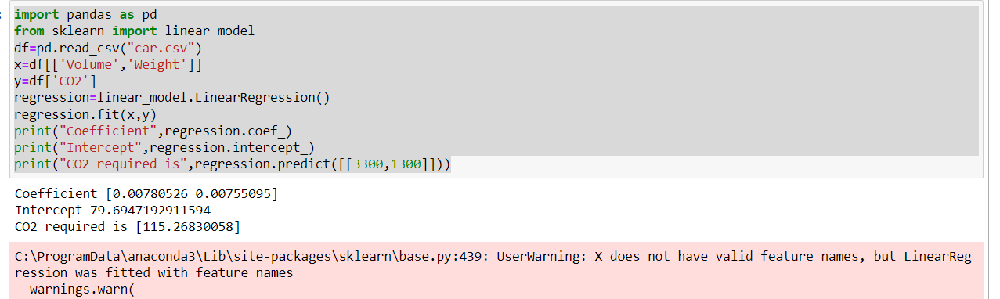

# Implementation of Multivariate Linear Regression
## Aim
To write a python program to implement multivariate linear regression and predict the output.
## Equipment’s required:
1.	Hardware – PCs
2.	Anaconda – Python 3.7 Installation / Moodle-Code Runner
## Algorithm:
### Step1
Import necessary libraries (pandas and sklearn) and read the dataset car.csv.

### Step2
Extract features (Volume, Weight) as X and target (CO2) as y.

### Step3
Train a LinearRegression model using X and y.

### Step4
Print the coefficients (coef_) and intercept (intercept_) of the trained model.

### Step5
Predict and print the CO2 emission for input [3300, 1300].

## Program:
```
/*
 Program for flipflops and verify its truth table in quartus using Verilog programming.

Developed by: AKASH CT

RegisterNumber: 24901150
*\
```
```
import pandas as pd
from sklearn import linear_model
df=pd.read_csv("car.csv")
x=df[['Volume','Weight']]
y=df['CO2']
regression=linear_model.LinearRegression()
regression.fit(x,y)
print("Coefficient",regression.coef_)
print("Intercept",regression.intercept_)
print("CO2 required is",regression.predict([[3300,1300]]))
```
## Output:



## Result
Thus the multivariate linear regression is implemented and predicted the output using python program.